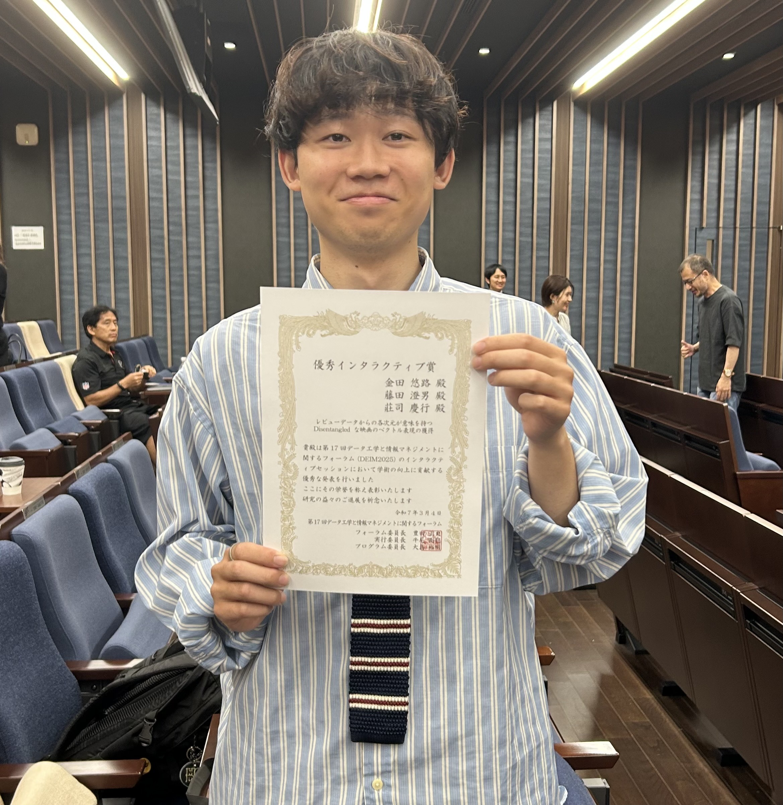

+++
date = '2025-03-04'
title = "DEIM2025 優秀インタラクティブ賞"
draft = false
award_label = "学会表彰"
+++

優秀インタラクティブ賞は、優れたポスター発表を行った発表者に与えられる賞です。  
380件超の発表から、上位5件しか選ばれない、とても獲得するのが難しい賞です。  
授賞式は2025年6月21日に、専修大学神田キャンパスで第16回ソーシャルコンピューティングシンポジウムの一環として行われました。

硬いテーマをいかにキャッチーに、そしてたくさんの議論ができるよう、多くの対話を意識した発表を行いました。

学部生として、このような価値ある賞を受賞できたのは自分にとって大きな自信につながりました。  
特に、他大学の教授陣からの評判がよく、貴重なアドバイスをたくさんいただくことができました。

## 関連リンク

- [静岡大学情報学部ニュース](https://www.inf.shizuoka.ac.jp/news/4338/)
- [LINEヤフーの研究開発ニュース](https://research.lycorp.co.jp/jp/news/31)
- [DEIM2025表彰情報](https://pub.confit.atlas.jp/ja/event/deim2025/content/awards)
- [莊司研究室ニュース](https://shoji-lab.github.io/%E7%99%BA%E8%A1%A8/2025/05/21/DEIM2025Award2.html)