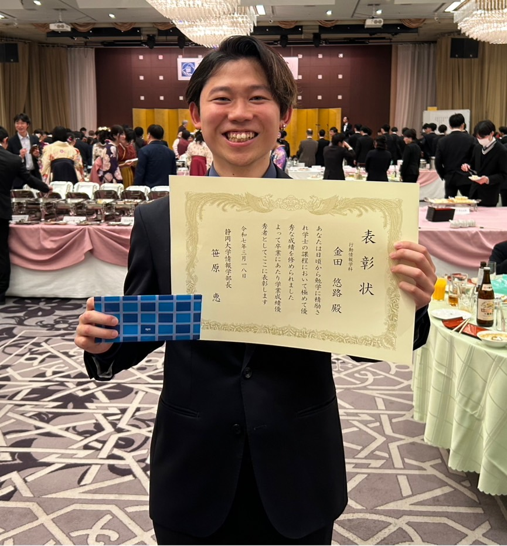

+++
date = '2025-03-18'
title = "静岡大学情報学部長学習奨励賞"
draft = false
award_label = "学内表彰"
+++

本日3月18日、昨年度の静岡大学情報学部長による表彰にて、
栄えある賞である **「静岡大学情報学部長学習奨励賞」** をいただきました。

「静岡大学情報学部長学習奨励賞」は、
情報学部の中で学部4年間の学業成績や研究活動での活躍など、
特に優れた学生に対して与えられる賞です。

これまで継続してきた研究を、
このような形で評価していただけてとても嬉しいです。
この経験に慢心せず、大学院でも意欲的な研究を続けていきたいと思います。
