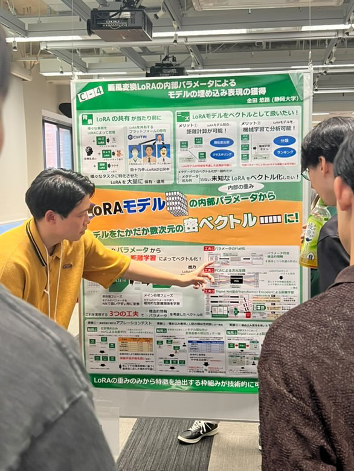

+++
date = '2025-09-11'
title = "DBWS2025 優秀賞"
draft = false
award_label = "学会表彰"
+++

DBWSは学会等による公的な催しではなく、関西東海地区のデータベース分野の研究室が合同で開催しているワークショップで、例年100名前後の参加者がポスター発表をしあうイベントです。

ポスターセッションではセッションごとに発表者と聴衆に分かれて、聴衆は良いと思った発表に投票します。
投票結果をもとに最優秀発表賞が5件、優秀発表賞が10件がそれぞれ選ばれ、授与されました。

なかなか人が集まりにくいポジションでの発表でしたが、驚くべき投票率で  
何とか優秀発表賞をいただきました。

## 関連リンク

- [静岡大学情報学部ニュース](https://www.inf.shizuoka.ac.jp/news/4577/)
- [DBWS2025受賞](https://sites.google.com/mil.doshisha.ac.jp/dbws-2025/%E5%8F%97%E8%B3%9E?authuser=0)
- [莊司研究室ニュース](https://shoji-lab.github.io/%E7%99%BA%E8%A1%A8/2025/09/13/dbws2025aword.html)