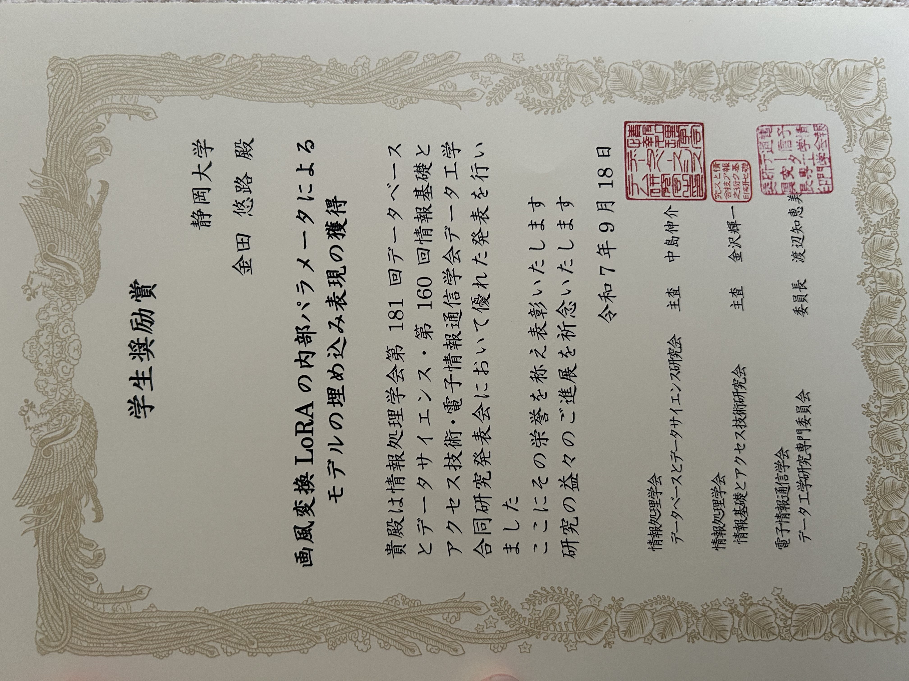

+++
date = '2025-09-16'
title = "WebDB2025 学生奨励賞"
draft = false
award_label = "学会表彰"
+++

データベース分野の主要な研究集会である研究発表会およびWebDB Forumにて、  
特に優れた研究発表を行った学生に贈られる賞です。

選考委員による投票に基づいて決定され、将来の発展が期待される若手研究者を奨励する目的で表彰が行われました。

大学院での新たな研究テーマで初めてのプレゼンテーションの機会でしたが、  
自分の研究の面白さをしっかり伝えたうえで、多くの学びある意見をいただきました。

## 関連リンク

- [静岡大学情報学部ニュース](https://www.inf.shizuoka.ac.jp/news/4598/)
- [WebDB2025学生奨励賞](https://www.ipsj.or.jp/award/dbs-award1.html)
- [莊司研究室ニュース](https://shoji-lab.github.io/%E7%99%BA%E8%A1%A8/2025/09/18/WebDB_award.html)