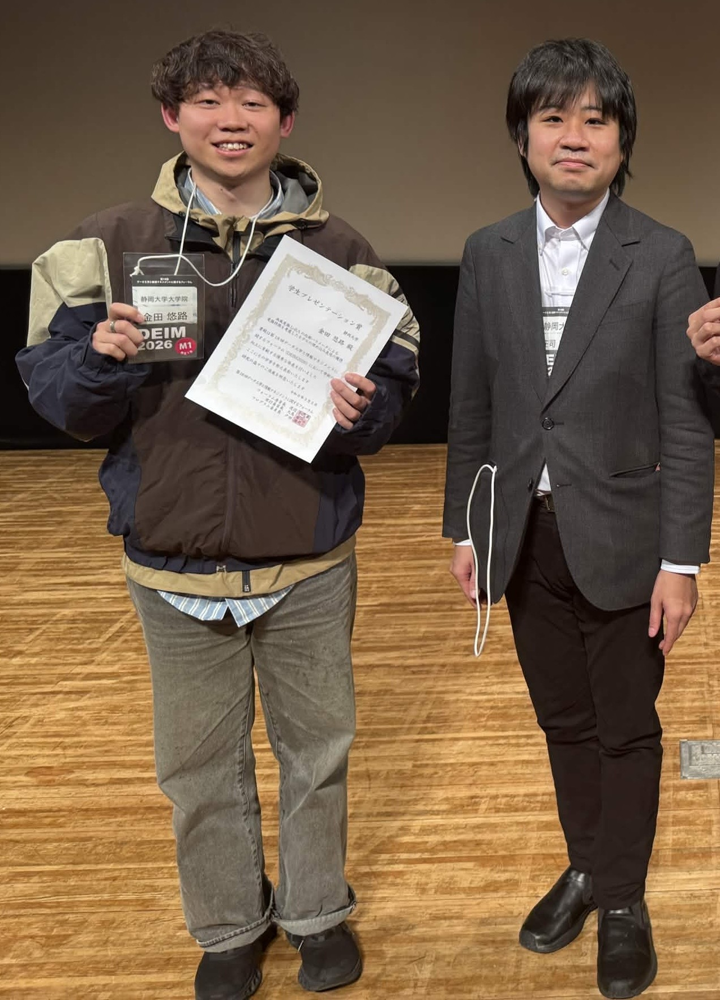

+++
date = '2026-02-28'
title = "DEIM2026 学生プレゼンテーション賞"
draft = false
award_label = "学会表彰"
+++

DEIM2026フォーラムにおいて学生による優れた研究発表に対して贈られる賞です。 
8ページ程度の論文と、20分程度のプレゼンテーションをもとに研究が評価され、  
5名程度からなるセッションごとに最大1件の学生プレゼンテーション賞が授与されます。

発表内容の学術的貢献に加え、論理的な構成やプレゼンテーションの明快さ、  
質疑応答での対応力などが総合的に評価されます。

去年に引き続き今年も受賞することができ、非常にうれしいです。  
研究室で育んだ「伝える力」と物事の問題を見極める「考える力」を生かして今後も積極的な議論を行っていけるように励みたいと思います。

## 関連リンク

- [静岡大学情報学部ニュース](https://www.inf.shizuoka.ac.jp/news/5076/)
