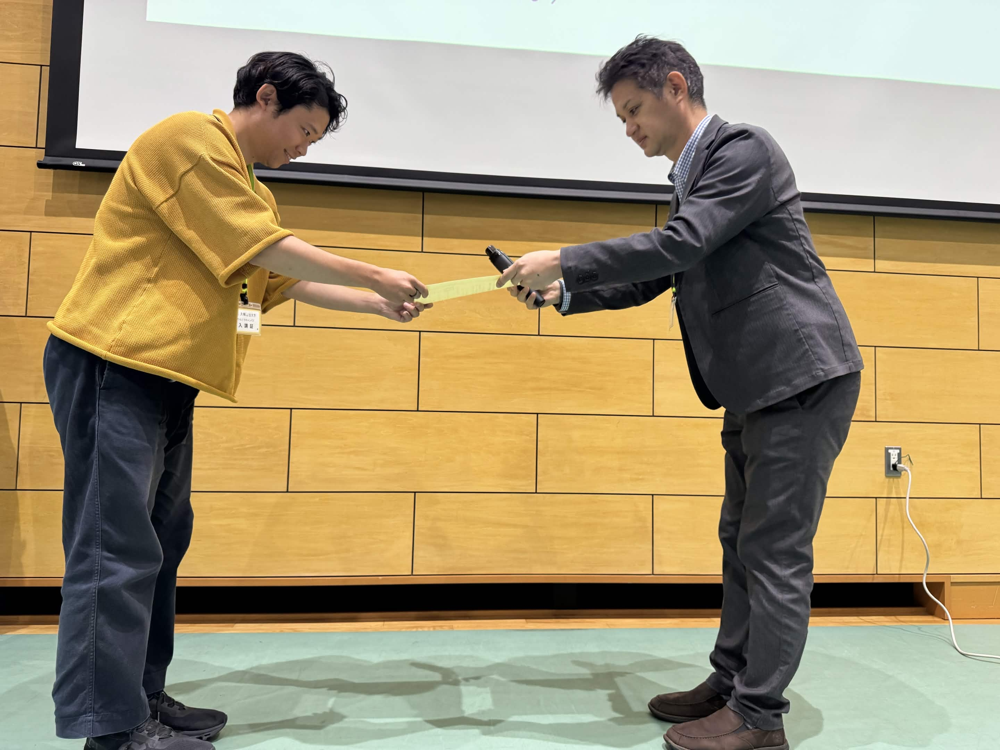

+++
date = '2026-09-17'
title = "WebDB2026 学生奨励賞"
draft = false
award_label = "学会表彰"
+++

データベース分野の主要な研究集会である研究発表会およびWebDB Forumにて、  
特に優れた研究発表を行った学生に贈られる賞です。

選考委員による採点に基づいて決定され、将来の発展が期待される若手研究者を奨励する目的で表彰が行われました。

今回は、受賞者の代表として表彰状の授与をさせていただきました。  
昨年に引き続き二年連続でこのような賞をいただけたことを嬉しく思います。  
二本の発表が同セッションでありましたが、どちらの発表も高く評価していただいたことを誇りに思います。

国際会議に向けてより研究を発展させていただきたいと思います。

## 関連リンク

- [静岡大学情報学部ニュース](https://www.inf.shizuoka.ac.jp/news/5815/)
- [WebDB2026学生奨励賞](https://www.ipsj.or.jp/award/dbs-award1.html)
- [莊司研究室ニュース](https://shoji-lab.github.io/%E7%99%BA%E8%A1%A8/2026/09/18/WebDB2026Award.html)