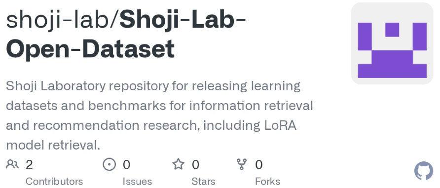

+++
date = '2026-02-10T00:42:50+09:00'
draft = false
title = '莊司研究室オープンソースデータセット'
[cover]
image = "OSS.png"
relative = true
+++
<!-- 

--- -->

## 概要
本プロジェクトは，研究データセットの公開を体系化し，再現可能な研究基盤を構築することを目的として実施したものである。

GitHub上に「Shoji Lab Open Dataset」を立ち上げ，研究室で公開される各データセットへのリンクを一元管理する仕組みを構築した。

さらに，データセット公開に関するガイドラインを設計・文書化し，
- 研究の再現性確保
- 継続的な公開運用
- 倫理・権利面への対応

を満たすデータ公開プロセスを確立した。

また，本取り組みの一環として，自身の主著論文の公開と同時に「LoRA Triplet Dataset」を公開し，研究成果の透明性および再利用性の向上に貢献した。

---

## 担当・貢献内容
- データセット公開のための**全体設計**
- 公開ガイドラインの**作成・整備**
- GitHub上のデータセットハブの**構築・運用**
- 主著論文に対応したデータセットの**公開**

---

## 特徴

### 1. 再現性を重視した設計
再現に必要な情報のみを公開対象とする設計とした：
- アノテーション
- データ分割情報（split）
- メタデータ
- 評価コード

### 2. 倫理・権利への配慮
著作権および再配布制約に対応するため：
- 原画像の再配布は行わない
- LoRA重みは公開しない
- ID・アノテーションなどの派生情報のみ公開

### 3. 継続的な公開基盤
- 構造化されたリポジトリ設計
- 長期的なアクセスを前提とした公開（DOI付与を想定）
- 将来の研究者が再利用可能なドキュメント整備

---

## データセット公開マニュアル
研究室内でのデータ公開を標準化するため，詳細な公開マニュアルを作成した。

主な内容：
- 公開方針・原則
- 倫理対応方針
- 公開前チェック項目
- 対象ユーザの定義

👉 [データセット公開マニュアルはこちら](https://scrapbox.io/shoji-lab-survey/%E8%8E%8A%E5%8F%B8%E7%A0%94%E7%A9%B6%E5%AE%A4%E3%83%87%E3%83%BC%E3%82%BF%E3%82%BB%E3%83%83%E3%83%88%E5%85%AC%E9%96%8B%E3%83%9E%E3%83%8B%E3%83%A5%E3%82%A2%E3%83%AB)

---

## 成果・意義
- 研究室における**再現可能研究の基盤を構築**
- データセット公開の**標準プロセスを確立**
- 学術コミュニティへの貢献および共同研究の促進に寄与
