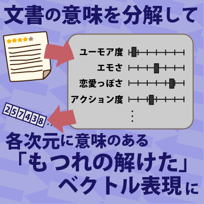
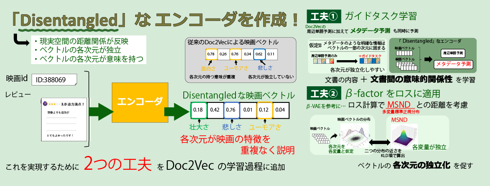

+++
date = '2025-12-08T00:42:50+09:00'
draft = false
title = '文書を「各次元が独立して意味を持つベクトル」に変換し解釈可能なベクトル化獲得'
summary = 'iiWAS2025「Learning Disentangled Document Representations Based on a Classical Shallow Neural Encoder」'
[cover]
image = "thumb.png"
relative = true
+++
<!-- 
 -->

## 文書の意味を解きほぐして、
## 意味ごとに整理されたベクトルを作ろう！

---

## 概要
この研究では、映画レビューなどの「文書」を、各次元が独立した意味を持つ形でベクトルとして表現する方法について提案しています。

現代ではすべてのデータを数値の列（ベクトル）として扱うことは極めて一般的ですが、これまでに使われていたベクトル化手法は、ベクトルの各次元が意味を持たず、なおかつ複数の次元が連動したりしていました。

そこで、各次元が独立で、それぞれ意味を持つように文書をベクトル化する方法を考えます。

単純で古典的な「Doc2Vec」というベクトル化手法に、各次元の独立性を担保するための正規化項を加えることで、「もつれの解けた（Disentangled）」ベクトルの獲得を目指します。

---

## 研究背景
近年では、どんなデータでも数値の列（＝ベクトル）として表すことが一般的になっています。

- 単語
- 文書
- 画像
- 音楽

これらすべてがベクトルとして扱われています。

これは、類似度計算や機械学習・AIの入力として、数値列が扱いやすいためです。この処理は「Embedding（埋め込み）」と呼ばれ、その機能を担うものは「エンコーダ」と呼ばれます。

しかし従来の手法では、

- 各次元が独立しているかは考慮されない  
- 各次元が意味を持つ必要もない  

という特徴がありました。

一方で、各次元に意味があれば、例えば以下のような応用が可能になります：

- 「少しだけ悲しみの度合いが高い文書」を検索  
- 「ユーモラスさ」で文書を並び替える  

このようなベクトルは「Disentangled（もつれの解けた）」表現と呼ばれ、主に画像分野で研究されてきましたが、

- 手法が複雑  
- テキストへの応用が難しい  

という課題がありました。

---

## 提案手法
本研究では、軽量で広く使われるベクトル化手法である **Doc2Vec** を拡張し、

- 従来通りの用途に使える  
- 各次元が独立して意味を持つ  

という両立を目指しました。

### Doc2Vecの基本
Doc2Vecはシンプルなニューラルネットワークを用いて、

- 文書中の単語の文脈予測  

を通じて文書ベクトルを学習します。

---

### 拡張のポイント
Doc2Vecに以下の2つの工夫を追加しました：

#### 1. ガイドタスクの導入
各次元が意味を分担するように、次元ごとに分かれやすい補助タスクを同時に学習させます。

#### 2. 次元の独立性の制約
複数の次元が連動しないように、

- 多変量正規分布との差（KL-divergence）

を利用して、次元間の依存を抑制します。

---

### 効果
これにより、モデルは

- 文脈予測だけでなく  
- 次元同士が干渉しないように  

注意しながら学習するようになります。

結果として、

- Doc2Vecと同様に使える  
- かつ意味を持つ独立な次元を持つ  

ベクトルが得られるようになります。

---

## 実験と結果

### 評価方法
ベクトルの良し悪しは直接見ても分からないため、

- 映画レビューをベクトル化  
- 映画同士の類似度を計算  
- 人間が「似ているか」を評価  

というタスクで検証しました。

---

### 結果①：類似度の妥当性
提案手法により、

- 内容が似ている映画同士が近いベクトルになる  

ことが確認されました。

---

### 結果②：次元の独立性
「次元の直交度」を指標に評価した結果、

- 通常のDoc2Vecよりも独立性が向上  

していることが確認されました。

---

### 課題：意味の解釈性
一方で、

- 各次元は何らかの意味を持っている可能性はある  
- しかし人間にはその意味が直感的に分からない  

という結果となりました。

つまり、

- **独立性は達成できた**
- **解釈性にはまだ課題がある**

ということが分かりました。

---

## 文献情報
- **タイトル**  
  Learning Disentangled Document Representations Based on a Classical Shallow Neural Encoder  

- **著者**  
  Yuro Kanada, Sumio Fujita, Yoshiyuki Shoji  

- **書誌情報**  
  Proc. of The 27th International Conference on Information Integration and Web Intelligence (iiWAS2025), pp. 63–78, 2025  

- **掲載サイト**  
  https://doi.org/10.1007/978-3-032-11976-6_5
