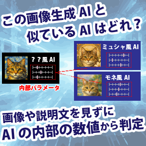
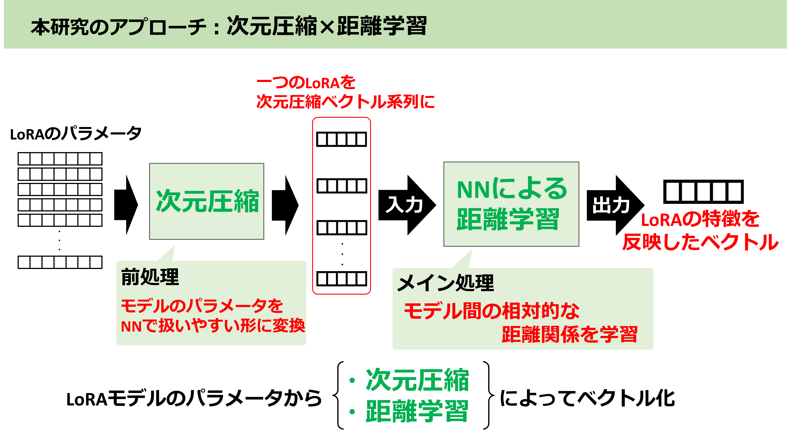

+++
date = '2026-04-15T00:42:50+09:00'
draft = false
title = '画像生成AIの類似度を、AIの内部パラメータから計算可能にしよう！'
summary = 'ICMR2026「Retrieval of LoRA Models based on Layer-Wise Weight Embedding without Metadata」'
[cover]
image = "thumb.png"
relative = true
+++
<!-- 
 -->

## 画像生成AI同士の類似度を、
## 説明文や出力例などを使わずに計算可能に！

---

## 概要
この研究では、画像生成AIに追加して画風や作風を変化させる **LoRA** を、説明文・タグ・サンプル画像なしでベクトル化する方法を提案しています。

LoRAは大量に公開されていますが、現状の検索は投稿者が付けたメタデータ頼りで、重みファイルそのものから「このLoRAはどんな変換をするか」を探すことは困難でした。

そこで本研究では、LoRAの内部重みをそのまま読み取り、各層ごとの特徴を保ったまま圧縮し、Transformer を用いた距離学習によって、**似た変換を行うLoRAどうしが近くなる埋め込み空間** を学習します。

これにより、未知のLoRAが1つ与えられたときでも、そのLoRAと見た目の変換傾向が近い別のLoRAを安定して検索できるようになります。

---

## 研究背景
近年では、Stable Diffusion などの画像生成AIに後付けできる軽量アダプタとして、LoRA が広く使われています。

- 特定の画風を加える
- キャラクター性を付与する
- 衣装や質感の変換を強める

といった目的で大量のLoRAが学習・共有されており、Civitai や Hugging Face には膨大な数のLoRAが集まっています。

しかし従来のLoRA検索は、

- タグ
- 説明文
- 生成サンプル画像

のような付随情報に大きく依存していました。

そのため、

- メタデータが不十分なLoRAを見つけにくい
- 古いLoRAでは説明文や出力例が失われていることがある
- 社内や研究室内で大量管理しているLoRAの整理が難しい

という課題があります。

一方でLoRAは本来、各層に対する「重みの変化量」を保存したものです。  
もしこの内部パラメータそのものからLoRAの特徴を表せれば、メタデータに頼らずLoRA同士を比較・検索できるようになります。

---

## 提案手法
本研究では、LoRA の内部重みを直接入力として、1つの埋め込みベクトルに変換するエンコーダを構築しました。

- 従来のようにメタデータへ依存しない
- 各層の構造を保ったままLoRAを表現する
- 類似LoRA検索に使える距離空間を学習する

という点が狙いです。

### 1. LoRA重みを層ごとのベクトル列に変換
LoRAは低ランク行列で各層の重み更新を表しています。そこでまず、圧縮行列と復元行列を掛け合わせて元の重み形状に戻し、それを層ごとに一次元ベクトルへ展開します。

この処理により、

- LoRAごとにrankが違っていても共通長で比較できる
- 層の並び順を保ったまま特徴を扱える

ようになります。

Stable Diffusion v1.5を対象とした実験では、1つのLoRAは 264 層分の情報を持ち、それぞれの層の重みを順番つきのベクトル列として表現しました。

---

### 2. 各層ベクトルを IPCA で圧縮
重みベクトルはそのままだと非常に高次元で、層によっては数十万から数千万次元に達します。

そこで各層に対して **Incremental PCA (IPCA)** を適用し、重要な情報を保ったまま低次元に圧縮します。極端に大きい層は分割して圧縮し、最後に連結します。

これによりLoRA全体は、

- 「層ごとの低次元ベクトル」が並んだ系列データ

として扱えるようになります。

---

### 3. Transformer と Triplet Loss で距離学習
次に、この層ベクトル列を Transformer Encoder に入力し、LoRA全体を1本の埋め込みベクトルへ集約します。

ここでは、

- 層の順序を表す位置埋め込み
- 層ごとの重要度を調整する MLP 集約
- 類似LoRAを近づけ、非類似LoRAを遠ざける Triplet Loss

を組み合わせています。

学習時には、あるLoRAを基準として

- 似た変換をする LoRA
- 似ていない変換をする LoRA

の三つ組（triplet）を作り、相対的な近さを学習させます。

その結果、未知のLoRAが与えられても、その内部パラメータだけから「どのLoRAと変換傾向が近いか」を検索できるようになります。

---

## 実験と結果

### 評価方法
実験では、Civitai から収集した style transfer LoRA を使い、学習用 549 件、検証用 100 件、評価用 150 件のデータセットを構築しました。

各LoRAについて変換画像を生成し、画像埋め込みの類似度から triplet を作成して学習データを整備しています。さらに、人手評価では参加者に出力画像を比較してもらい、「どちらのLoRAが基準LoRAにより近い変換をしているか」を選んでもらいました。

---

### 結果①：埋め込み学習そのものが有効
まず、Triplet Loss と Triplet Accuracy により、埋め込み空間が正しく学習できているかを評価しました。

提案手法は比較した全手法の中で最も良い性能を示し、

- Triplet Accuracy: `0.731`
- Baseline: `0.505`

となりました。

特に、

- 位置埋め込みを入れて層順序を明示すること
- 層ごとの寄与を調整する MLP 集約

が性能向上に効いており、LoRAの「どの層がどう変化しているか」という構造情報が重要だと分かりました。

---

### 結果②：人間の感覚に近い類似度になった
次に、人間が「この2つは似た変換をしている」と感じる判断と、埋め込み空間での近さが一致するかを調べました。

その結果、提案手法は human-labeled triplet に対しても最良の性能を示し、

- Triplet Accuracy: `0.780`

を達成しました。

これは、内部パラメータだけから作ったベクトルであっても、実際の見た目の変換の近さをかなり反映できていることを示しています。

---

### 結果③：LoRA検索でも安定して強い
最後に、30個のクエリLoRAを使って、類似LoRA検索のランキング性能を評価しました。

提案手法は、

- Recall@10: `0.420`
- NDCG@10: `0.513`

を記録し、全比較手法の中で最高でした。

また、標準偏差も小さく、クエリごとのばらつきが少ないことから、平均性能だけでなく **検索の安定性** にも優れていることが確認されました。

---

### 今後の展望
この研究により、LoRAの内部重みだけから、LoRA同士の変換傾向を比較・検索できることが示されました。

今後は、

- テキストからLoRAを探す検索
- 大規模LoRAライブラリの整理・推薦
- 権利侵害が疑われるLoRAの検出支援

といった応用につながることが期待されます。

## 文献情報
- タイトル：
    - Retrieval of LoRA Models based on Layer-Wise Weight Embedding without Metadata
- 著者：
    - Yuro Kanada, Yuma Oe, Huu-Long Pham, Makoto P. Kato, Hiroaki Ohshima, Sumio Fujita, Yoshiyuki Shoji
- 書誌情報：
    - Proc. of the 16th ACM International Conference on Multimedia Retrieval (ICMR 2026), to appear, 2026

<!-- - **掲載サイト**  
  https://doi.org/10.1007/978-3-032-11976-6_5 -->
